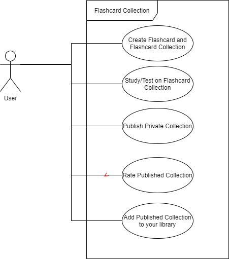

# Flashcard Collection

## Project Abstract
Flashcard Collection is a web application whose core goal is to create, maintain, and curate collections of flashcards that people can use to study for and learn about various subjects. Users will be able to create private flashcard collections for themselves and can choose to publish them for others to see and use if they wish to. Once a collection is created, the user will be able to go through them and study using the collection. Published collections will be added to the applications collection library and made available to all users. Users will be able to rate published collections based on helpfulness. The application is a full stack project and requires a front end website for user interaction, a backend for processing request and a database for storage. 

## Project Relevance
One of the big goals is to become familiar working with frameworks(laravel) and following design patterns such as MVC which promote good coding practices by seperating application concerns. Following this, many of goals set out for this class will also be met including object oriented design, test driven development, creating graphic user interface, working with databases, project management and version control. These goals are important because a lot of real-world projects depend on working with and integrating multiple systems. Being able to work with a database is especially important as pretty much all systems have some sore of need to store and integrate data into their project. Also being able to use a version control system is incredibly important as projects have multiple development and release cycles, and allow many people to work on the project at the same time.

## Conceptual Design
Since this is a stand alone project, we will essentially be making it from scratch. For the technologies being used, I plan to use a LAMP stack (linux, apache, mysql, php). The project will utilize the Laravel PHP framework and follow the MVC (model-view-controller) pattern. It will also utilize some open source js packages to add functionality such as picture upload/modification. We will need to create a front end interface that is simple, easy to use, and provides a good flow for the user. 

Flashcards will have multiple sides, and each side will consist of a label, a question or some text, and a weight, and optionally a picture. Weights are used during study sessions to show incorrect cards more frequently to help with studying.
A Collection will consist of multiple related flashcards (by subject or test). Collection will have a title, and category / subject associations.

An example deck for a chemistry class would have a card like:
Side 1
Label: Chemical Formula
Text: H20
Picture (Optional)
Weight: 50
Side 2
Label: Chemical Name
Text: water
Picture (Optional)
Weight: 50

## Required Resources
- Group members should have some experience developing a web app and be familar with atleast 1 or more of the following Javascript, HTML, MySql, PHP, css.
- Laravel
- Node.js 
- Apache HTTP server
- MySql ^8
- PHP ^7.2

## Building and Running
You are going to need to install composer. 
I also recommend installing [Virtualbox](https://www.virtualbox.org/wiki/Downloads) and [Vagrant](https://www.vagrantup.com/downloads.html), this will make running locally very easy. 
It also makes sure that we are working in the same environment regardless of what OS you are running.
The first time it takes some time but subsequents builds are a lot faster.

1. install composer and vagrant
2. rename .env.example to .env
3. run the following commands
> composer install.

> Windows
> vendor\bin\homestead make

> Mac / Linux
> php vendor/bin/homestead make

> vagrant up

4. Add the following line to your host file
> 192.168.10.10 flashcard.test

Windows: C:\Windows\System32\drivers\etc\hosts
Mac/Linux: /etc/hosts

The app can be accessed at the url: flashcard.test

## About Laravel

Laravel is a web application framework with expressive, elegant syntax. We believe development must be an enjoyable and creative experience to be truly fulfilling. Laravel takes the pain out of development by easing common tasks used in many web projects, such as:

- [Simple, fast routing engine](https://laravel.com/docs/routing).
- [Powerful dependency injection container](https://laravel.com/docs/container).
- Multiple back-ends for [session](https://laravel.com/docs/session) and [cache](https://laravel.com/docs/cache) storage.
- Expressive, intuitive [database ORM](https://laravel.com/docs/eloquent).
- Database agnostic [schema migrations](https://laravel.com/docs/migrations).
- [Robust background job processing](https://laravel.com/docs/queues).
- [Real-time event broadcasting](https://laravel.com/docs/broadcasting).

Laravel is accessible, powerful, and provides tools required for large, robust applications.

## Learning Laravel

Laravel has the most extensive and thorough [documentation](https://laravel.com/docs) and video tutorial library of all modern web application frameworks, making it a breeze to get started with the framework.

If you don't feel like reading, [Laracasts](https://laracasts.com) can help. Laracasts contains over 1500 video tutorials on a range of topics including Laravel, modern PHP, unit testing, and JavaScript. Boost your skills by digging into our comprehensive video library.

## Laravel Sponsors

We would like to extend our thanks to the following sponsors for funding Laravel development. If you are interested in becoming a sponsor, please visit the Laravel [Patreon page](https://patreon.com/taylorotwell).

### Premium Partners

- **[Vehikl](https://vehikl.com/)**
- **[Tighten Co.](https://tighten.co)**
- **[Kirschbaum Development Group](https://kirschbaumdevelopment.com)**
- **[64 Robots](https://64robots.com)**
- **[Cubet Techno Labs](https://cubettech.com)**
- **[Cyber-Duck](https://cyber-duck.co.uk)**
- **[Many](https://www.many.co.uk)**
- **[Webdock, Fast VPS Hosting](https://www.webdock.io/en)**
- **[DevSquad](https://devsquad.com)**
- **[OP.GG](https://op.gg)**

## Contributing

Thank you for considering contributing to the Laravel framework! The contribution guide can be found in the [Laravel documentation](https://laravel.com/docs/contributions).

## Code of Conduct

In order to ensure that the Laravel community is welcoming to all, please review and abide by the [Code of Conduct](https://laravel.com/docs/contributions#code-of-conduct).

## Security Vulnerabilities

If you discover a security vulnerability within Laravel, please send an e-mail to Taylor Otwell via [taylor@laravel.com](mailto:taylor@laravel.com). All security vulnerabilities will be promptly addressed.

## License

The Laravel framework is open-sourced software licensed under the [MIT license](https://opensource.org/licenses/MIT).
